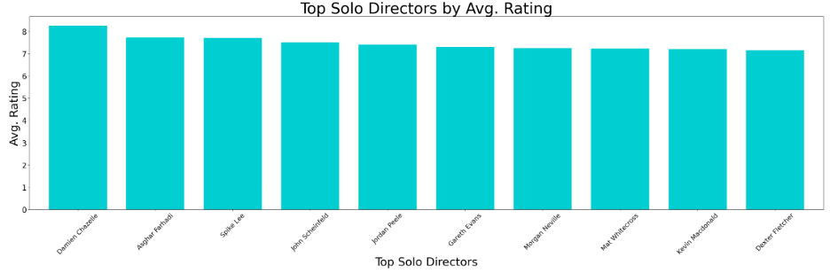
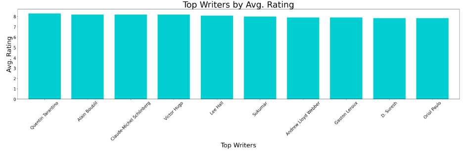

# Movie EDA Project
Authors: [Emily Krueger](https://github.com/ekrueger1217) & [Reid Majka](https://github.com/reidmajka/)

## Business Overview
RE Corp. is excited to announce our latest venture RE Studios. As we devise our expansion into the film industry, we will address the following:
1. How should we distribute capital and fund projects?
2. What genres should we focus on to ensure we're producing highly profitable and highly rated films?
3. How should we plan our annual release schedule to optimize profitability?
4. What writers and directors should we aim to work with?

## Data Understanding & Analysis

## Data Overview
In building this business case, we analyzed data from Rotten Tomatoes, IMDB, TheMovieDB, and The Numbers. The Rotten Tomatoes dataset contains ~54k reviews of films and ~1.5k records of film information, such as synopsis, genre, release date, and runtime. The IMDB dataset contains ~260k records. To address our specific interests, we removed duplicate films from the IMDB dataset, reduced this dataset to include only films that were released in english speaking regions (United States, Canada, Great Britain, Austrailia, Ireland, and New Zealand), removed films that had less that 50 rating votes, and including only films that had runtime information listed, resulting in a dataset of ~19k records. TheMovieDB dataset contains ~27k records with film titles, ratings, language, and genres. The Numbers dataset contains ~6k records with movie id's, release dates, and financial information such as production budget, domestic gross revenue, and worldwide gross revenue. These datasets were observed individually and in combination with each other to assess historical film performance in terms of various metrics.

### Analysis and Business Recommendations
1. We intend on pursuing projects that require ~$4M in funding and believe with 95% confidence, these films will have a mean ROI between xx13% to 25%xx
    * For investors seeking a higher relative return, we will focus on films <$1M
    * For riskier investors seeking higher absolute returns, we are willing to accept budgets in the $3-4M range
      

2. We'll focus on the following genres to optimize ROI and ratings: i) Musical, ii) Animation, iii) Family,  iv) Mystery, and Horror
    * Profitability will serve as primary driver in decision making; however, rating will play a part as producing highly rated movies is crucial in establishing legitimacy in the industry
    * Musicals tend to have the highest average ROI and fifth highest average rating in comparison to other genres (excluding outliers who's ROI is in the top 2% of the dataset)
    * Animation, Family, and Mystery also have relatively high aveage ROI's while also, on average, receiving high ratings from critics
    * Although horror films are on average not highly rated in comparison to other genres, they do on average have high ROI's, as many horror films are inexpensive to make and garner massive cult followings with the potential to be catapulted to main stream success
  

3. We will plan our releases for April, July, October, and November, as films released in these months have historically had the highest average ROI's
    * Additionally,each year we'll devise a genre based annual launch schedule with animation films released in April, mystery/horror films realeased in July, horror films released in October, and musical films released in November
  

4. We aim to work with writers and directors whose prior films are highly rated in comparison to peers
    * We found that at a 95% confidence level, movies that have a solor director on average are rated higher than movies that have a group of directors
    * With that, we'd like to wor with directors who not only have a history of directing highly rated movies but also have done so on projects where they are the sole director, such as Quentin Tarantino, Christopher Nolan, and Martin Scorcese among others shown below.

  * Additionally we'd like to work with writers whose prior films have been highly rated such as Jim Starlin, Christopher Nolan, and Mark Monroe
  * We also found that at a 95% confidence level, films where the writer also directs are on average rated higher than films where the writer is not involved in direction
  * With that, we'd like to encourage writers we're working with to also direct their films and believe this could result in cost savings as well

## Conclusion
With the below insights driving decision making, we are beyond excited for what the future holds at RE Studios and are confident success is imminent.
1. We intend on pursuing projects that require ~$4M in funding and believe with 95% confidence, these films will have a mean ROI between xx13% to 25%xx
2. We'll focus on the following genres to optimize ROI and ratings: i) Musical, ii) Animation, iii) Family,  iv) Mystery, and Horror
3. We will plan our releases for April, July, October, and November, as films released in these months have historically had the highest average ROI's, and we have devised a genre based annual release schedule
4. We'll aim to work with writers and directors whose prior films are highly rated in comparison to peers, and we will encourage writers to participate in direction

## Additional Considerations and Next Steps
1. We'd like to dive deeper into how budget and ROI are related on a by genre basis
2. As we are planning on producing films with relatively low budgets, we'd like to perform additional analysis regarding the percentage of low budget films that achieve success and produce high returns
3. In choosing films and hiring directors, we'd like to perform cost saving analysis associated with having writers participate in direction of their films

## Additional Materials
Please review our full analysis in our [Jupyter Notebook](xx) or our [Presentation](xx) . 

